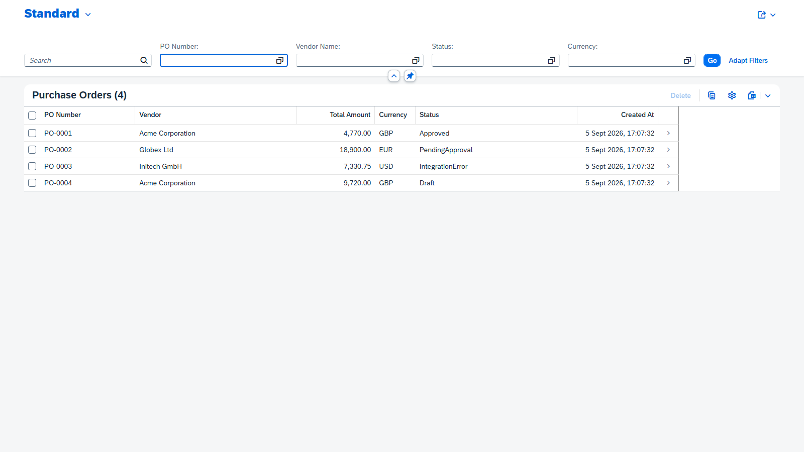
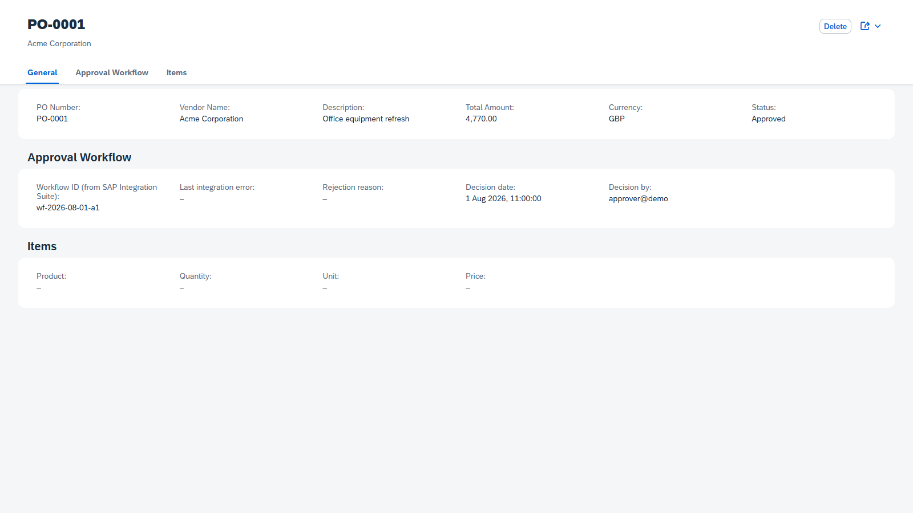

# Purchase Order Approval Automation on SAP BTP

A hands-on demo of **integration & automation on SAP BTP** built with the Cloud Application Programming Model (CAP) and SAP Integration Suite (Cloud Integration / CPI) — delivered through a **Fiori Elements** UI.

Creating a purchase order automatically kicks off an external approval workflow in SAP Integration Suite. The approval status is managed end-to-end in a CAP service and reflected live in the Fiori app.

> 👉 **Try it**: `npm ci && npm start`, then open <http://localhost:4004/purchase-orders> (Fiori UI) or <http://localhost:4004/odata/v4/purchase-order> (OData).

---

## Why this demo

This repository demonstrates the day-to-day delivery skills for SAP BTP consulting roles:

| Skill | Shown by |
|---|---|
| **Integration** | A CAP service calls an iFlow in SAP Integration Suite (CPI) via OData/REST, and reacts to its response (`workflowId`) |
| **Automation** | Creating a PO *automatically* submits it to the approval workflow; status transitions are enforced server-side |
| **Fiori app deployment** | A Fiori Elements List Report app, served by CAP, deployable to Cloud Foundry |
| **CAP development** | CDS domain model, service projections, custom event handlers, actions, UI annotations, tests, seed data |
| **Resilience & error handling** | Integration failures set an `IntegrationError` state, visible in the UI, with a **Retry** action to recover |
| **Engineering hygiene** | ESLint, automated tests, GitHub Actions CI, MTA deployment, conventional commits |

## Architecture

```
                       ┌────────────────────────────────────────────┐
                       │  SAP BTP, Cloud Foundry                     │
                       │                                            │
  Fiori Elements ───▶  │  CAP Service  ──▶  SAP Integration Suite    │
  (app/purchase-orders)│  (srv/)           (CPI iFlow)              │
                       │     │                                       │
                       │     ▼                                       │
                       │  SQLite / HANA Cloud                        │
                       │  (db/)                                      │
                       └────────────────────────────────────────────┘
```

The CAP service exposes `PurchaseOrders` (header) + `PurchaseOrderItems` (composition). After create it POSTs to a CPI integration flow:

```
POST <iFlow endpoint>  { purchaseOrderId, purchaseOrderNo, vendor,
                         totalAmount, currency, description }
→ 200  { workflowId: "..." }
```

The `workflowId` is stored on the PO and its status moves to **Pending Approval**. Approvers decide via the **Approve** / **Reject Request** actions.

## Status machine

```
Draft ──create──▶ Submitted ──CPI ok──▶ PendingApproval ──approve──▶ Approved
                                   └──────── reject ──▶ Rejected
        Submission failure ──▶ IntegrationError ──retry──▶ Submitted
```

All transitions are validated server-side (`403` if invalid).

## Quick start (local, no credentials required)

```bash
npm ci
npm start        # or: cds watch
```

- Fiori UI: <http://localhost:4004/purchase-orders>
- OData service: <http://localhost:4004/odata/v4/purchase-order>
- Fiori Elements preview (annotations): the `@cap-js/fiori-elements` preview is available via `cds watch`

Seed data (`db/data/*.csv`) ships 3 vendors and 4 purchase orders in different workflow states so the UI is populated immediately.

> The integration runs against a **built-in mock** when no CPI endpoint is configured, so the full automation flow works offline and in review. See below to wire a real SAP Integration Suite tenant.

## Run the tests

```bash
npm test         # node --test  (boots the service in-memory, runs 9 integration tests)
npm run lint
npm run build    # cds build --production
```

Tests cover: service exposure, seed data, auto-submission automation, approve/reject, invalid transition guards (403), integration failure → `IntegrationError` → retry recovery, and deep-insert of line items.

## SAP Integration Suite (CPI) — mock vs real

By default the service uses a **mock** that returns `{ workflowId }` after a short delay, so the demo is fully self-contained.

To call a **real CPI iFlow**, provide credentials — they are **never committed** to the repo:

```bash
# option A: environment variables
export CPI_API_URL=http://<tenant>.it-cpitrialXX.cfapps.<region>.hana.ondemand.com
export CPI_API_PATH=/http/poapproval
export CPI_USER=<your-user>
export CPI_PASSWORD=<your-password>

# option B: gitignored config file .cdsrc-private.json
{
  "requires": { "API_CPI": {
    "kind": "rest",
    "credentials": { "url": "...", "path": "/http/poapproval", "username": "...", "password": "..." }
  }}
}
```

### Setting up a CPI trial tenant

1. In your BTP **trial** account, subscribe to **Integration Suite** (Services → Instances and Subscriptions) and **activate the Cloud Integration capability**.
2. Assign yourself the roles `Integration_Provisioner` and `PI_Integration_Developer`.
3. In the Cloud Integration web UI, deploy an iFlow with an **HTTPS sender** that:
   - accepts `POST` JSON (payload above),
   - answers `200` with `{ "workflowId": "<uuid>" }`.
4. Point `CPI_API_URL` (+ user/password of the iFlow endpoint) at that iFlow.

The `srv/lib/integration.js` module isolates all CPI-specific logic behind one function.

## Deploy to BTP trial (live URL for reviewers)

Prerequisites: `cf` CLI (`cf --version`), a CF space on your trial, and Node 22+.

### Option A : `cf push` (recommended for the trial)

```bash
cf login -a <api> -o <org> -s <space>   # e.g. api.cf.us10.hana.ondemand.com
cf push -f manifest.yml
cf apps                    # find the app URL
```

The app URL (e.g. `https://po-approval-xxxx-trial.cfapps.<region>.hana.ondemand.com`)
is your clickable reviewer link. The Fiori UI is at `/purchase-orders/webapp/index.html`,
the OData service at `/odata/v4/purchase-order`.

> The demo pushes the **project root** (with a `.cfignore`): the CAP build only emits
> `srv/` into `gen/srv`, so the seed data (`db/data`) and the Fiori app (`app/`) must be
> included from the source tree. `srv/server.js` deploys the SQLite schema + seed on startup.

### Option B — MTA

```bash
npm i -g mbt               # needs Java (tested with OpenJDK 21)
npm run build
mbt build -t mta_archives
cf login -a <api> -o <org> -s <space>
cf deploy mta_archives/po-approval_1.0.0.mtar
```

### Wiring real CPI on CF

```bash
cf set-env po-approval CPI_API_URL   https://<tenant>.it-cpitrialXX.cfapps.<region>.hana.ondemand.com
cf set-env po-approval CPI_API_PATH  /http/poapproval
cf set-env po-approval CPI_USER      <iFlow-user>
cf set-env po-approval CPI_PASSWORD  <iFlow-password>
cf restage po-approval
```

> Demo note: the app runs on SQLite so reviewers need **no** HANA credentials to use the live URL. Data is re-seeded on each (re)deploy and the SQLite file is ephemeral (reset on restage). The app is intentionally **unauthenticated** (CAP `auth: mocked`) so the reviewer link needs no login — in production add XSUAA + AppRouter and bind HANA Cloud; the model and service require no changes for that.

## Repository layout

```
├── app/purchase-orders        Fiori Elements List Report app (manifest, index.html)
├── db/schema.cds              Domain model: Vendors, PurchaseOrders, PurchaseOrderItems
├── db/data/*.csv              Seed data (vendors + POs in every workflow state)
├── srv/po-service.cds         Service projections, actions, Fiori UI annotations
├── srv/po-service.js          Workflow logic: auto-submit, approve/reject/retry
├── srv/lib/integration.js     CPI integration (real iFlow or built-in mock)
├── test/                      End-to-end service tests (node --test)
├── mta.yaml                   Cloud Foundry deployment descriptor
└── .github/workflows/ci.yml   CI: lint + test + build
```

## Screenshots




